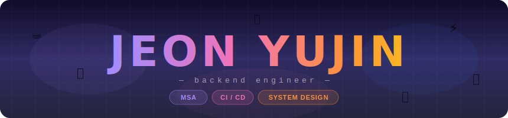
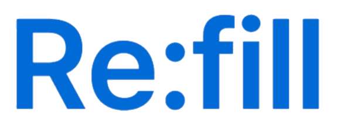

<!-- 터미널 헤더 SVG -->

 

<!-- Tech Stack Badges -->

---

## 👨‍💻 About Me — 전유진

안녕하세요!  
**어제보다 더 나은 코드를 고민하는 백엔드 개발자 전유진**입니다.  
단순한 기능 구현을 넘어, 복잡한 비즈니스 요구사항을 견고한 시스템 아키텍처로 치환하는 설계에 관심이 많습니다.  
막히는 구간이 생겨도 끈기 있게 탐색하며 끝까지 파고들어 해답을 제시하는 집요함을 가지고 있습니다.

---

## 📊 GitHub Stats

  

---
## 💡Summary

<!-- 트로피 대체: github-profile-summary-cards -->

  

---

## 📈 Contribution Graph

  

---

## 📚 프로젝트 경험

###  Book2OnAndOn — 온라인 서점 시스템 (MSA 기반)
> 기간: 2025.11.11 ~ 2025.12.31  
> 
> 역할: **Book-Service 개발 및 데이터 파이프라인/인프라 구축 (7인 프로젝트)**

#### 🔑 기여
- Spring Cloud 기반 **MSA 아키텍처 설계 및 구축**
- **Elasticsearch** 기반 고성능 복합 검색 엔진 구축
- 생성형 AI 모델 연동을 통한 **도서 데이터 증강 파이프라인** 설계
- **Docker & GitHub Actions**를 활용한 CI/CD 파이프라인 구축

#### 💡 문제 해결 사례
- **문제**: 기존 RDB의 조회 성능 한계 및 분산 환경에서의 데이터 불일치 이슈
- **해결**: Elasticsearch 도입으로 검색 성능을 개선하고, **RabbitMQ 기반 비동기 이벤트 처리**를 통해 최종적 일관성을 확보했습니다.
- **결과**: 시스템 간 결합도를 획기적으로 낮추고, 대용량 트래픽에 대비한 시스템 회복 탄력성을 극대화했습니다.

--- 

###  Re:fill — 프랜차이즈 재고관리 시스템 (Serverless 기반)
> 기간: 2025.03.10 ~ 2025.06.06 
> 
> 역할: **팀장 (PM) 및 백엔드 개발 (4인 프로젝트)**

#### 🔑 기여
- Firebase Serverless 기반 실시간 재고 관리 및 **자동 발주 스케줄링** 구현
- Cloud Firestore(NoSQL) 스키마 설계 및 비정규화(Denormalization) 패턴 적용
- 계층형 컬렉션 구조 설계를 통한 데이터 접근 경로 최적화 및 읽기 비용 절감
- 초대 코드 기반의 가맹점 가입 프로세스 및 **보안 규칙(Security Rules)** 연동

---

### 💬 NHN-CHAT - Java TCP Messenger — 클라이언트-서버 메신저 시스템
> 기간: 2026.01.28 ~ 2026.02.05 (2주)
> 
> 역할: **백엔드 개발 및 TCP 소켓 통신 구현 (2인 프로젝트)**

#### 🔑 기여 및 특징
- **Maven 멀티 모듈 아키텍처(Common, Server, Client)** 구조를 도입하여 모듈 간 의존성을 분리하고 확장성 및 유지보수성을 향상시켰습니다.
- **TCP Socket** 통신을 활용하여 다중 사용자의 실시간 접속 및 브로드캐스팅 환경을 구축했습니다.
- TCP 스트림의 경계를 명확히 구분하기 위해 헤더에 데이터 길이를 명시하는 **Text-based Length-Prefix 프로토콜을 직접 설계**했습니다.
- 공통 통신 규격을 정의하고, Jackson 라이브러리를 통해 **JSON Payload**를 효율적으로 직렬화/역직렬화했습니다.
- 사용자 인증(로그인/로그아웃), 채팅방 상태 관리(생성/목록/입장/퇴장), 1:1 귓속말(Private Message) 등 메신저의 핵심 도메인을 설계하고 구현했습니다.

---

## 🚀 성장 목표
- 기술적 깊이를 더해 회사가 필요로 하는 **신기술과 아키텍처를 선제적으로 학습**하는 개발자
- 사소한 기능 하나라도 **사용자의 편의성**을 최우선으로 고민하는 개발자
- 건강한 소통을 통해 합리적으로 역할을 분담하고 **시스템으로 돌아가는 팀워크**를 만드는 인재

