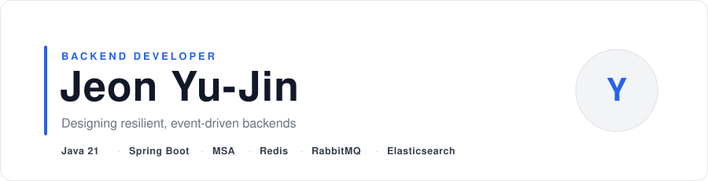

---

## About Me

**어제보다 더 나은 코드를 고민하는 백엔드 개발자 전유진입니다.**

정해진 방법을 그대로 따르기보다, 캐시 전략이나 데이터 적재 방식처럼 순간마다 직접 비교하고 판단하며 문제를 구조로 해결하는 데 집중합니다.
앞으로도 기능 구현에 그치지 않고, **트래픽이 몰리는 상황에서도 끊임없이 동작하는 백엔드 구조를 설계하는 개발자**가 되고자 합니다.

- 🏫 조선대학교 AI소프트웨어학부 (컴퓨터공학전공) · GPA 4.07 / 4.5
- 🎓 NHN Academy — Java Backend 12기 수료 · AIOT 웹서비스 개발자 과정
- 📫 wjsdbwls0303@gmail.com

---

## Tech Stack

**Language & Framework**

**Data & Messaging**

**Infra & DevOps**

---

## Featured Project

###  &nbsp;Book2OnAndOn — MSA 기반 도서 커머스 플랫폼

> 대규모 트래픽을 고려한 도서 커머스 플랫폼 · 2025.11 ~ 2025.12 · 7주 · 7인 협업
> **역할: Book 서비스 백엔드 설계·구현 및 인프라 구축** (Java 약 4.2만 라인 · 119 commits)

**Tech** · Java 21 · Spring Boot 3.5 · Spring Cloud · JPA / MySQL · Redis · Elasticsearch / RabbitMQ · Docker · Nginx / JUnit5 · Mockito · SonarQube

대규모 트래픽 환경에서 직접 발견한 **3가지 핵심 문제**를 구조적으로 해결했습니다.

**1. Redis Lua Script를 활용한 대규모 동시 주문 재고 제어**
- **문제** · 선착순 이벤트성 트래픽을 가정한 JMeter 부하 테스트에서 TPS 96.9 병목 발생
- **원인** · RDBMS 비관적 락의 락 대기가 DB 커넥션을 점유
- **해결** · 재고 확인·차감·예약 Hash 저장을 Redis Lua Script 원자적 연산으로 통합하고, 결제 확정 시점에만 비동기 DB 반영(지연 쓰기) → **TPS 96.9 → 1,925.7 (약 19.87배 ↑)**, 정합성 유지 및 Redis 장애 시 DB Fallback으로 단일 장애점 대비

**2. 외부 I/O와 DB 트랜잭션 경계 분리를 통한 안정성 확보**
- **문제** · 알라딘 API·AI 모델(Groq/Gemini) 응답 지연 시 전체 서비스의 DB 커넥션 풀 고갈
- **원인** · 외부 통신 구간과 DB 변경 구간이 하나의 `@Transactional`로 묶여 있음
- **해결** · 트랜잭션 전파 속성 세밀 제어 — 외부 호출은 `NOT_SUPPORTED`로 트랜잭션 우회, DB 반영 구간만 `REQUIRES_NEW`로 짧게 유지 → 외부 장애·지연의 **DB 전파 차단**

**3. 하이브리드 검색 속도와 AI 검색 품질의 트레이드오프 극복**
- **문제** · 사용자 응답 속도와 AI 기반 검색 품질을 동시에 확보해야 하는 상황 (도입 후 평균 869.5ms)
- **원인** · AI Reranking과 추천 로직이 동기 흐름에 묶여 응답 지연 발생
- **해결** · ES 1차 검색 결과 즉시 반환(FastPath) + AI 연산은 RabbitMQ 비동기 위임 후 Redis 캐싱 → **평균 869.5ms → 49.1ms (약 17.7배 ↑)**

**그 외 성과**
- **CI/CD** · GitHub Actions + SonarQube 품질 게이트 → Eureka 상태 제어 기반 **무중단 롤링 배포**
- **테스트** · JUnit5 · Mockito 기반 핵심 비즈니스 로직 **커버리지 84.3%** 달성

> 📁 그 외 프로젝트(Re:fill, NHN-CHAT, NHN Shopping Mall)는 [`archive/`](archive/)에서 볼 수 있습니다.

---

## GitHub

---

## Certifications

| 자격 | 발급 기관 | 취득일 |
|------|------|--------|
| 정보처리기사 | 한국산업인력공단 | 2025.06.13 |
| SQL 개발자 (SQLD) | 한국데이터산업진흥원(Kdata) | 2025.04.04 |
| TOPCIT Level 3 (555점) | 정보통신기획평가원(IITP) | 2025.06.23 |
